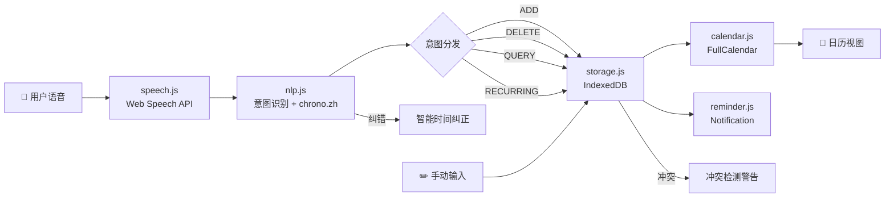

# 🎤 VoiCal — 语音日历工具

> 一个以语音交互为核心的智能日历管理工具，通过中文自然语言语音实现日程的高效管理。  
> 无需注册、无需后端、隐私优先。数据全部存储在浏览器本地。

**📹 Demo 视频**：*（待录制上传 B 站后补充链接）*

---

## ✨ 核心功能

| 功能 | 说明 |
|------|------|
| 🗣️ **语音添加事件** | "添加明天下午三点开会" → 自动创建事件 |
| 🗑️ **语音删除事件** | "删除开会" → 模糊匹配删除 |
| 🔍 **语音查询日程** | "查看本周日程" → 语音播报安排 |
| 🔁 **重复事件** | "每周五下午一点组会" → 自动生成未来 8 周事件 |
| 🧠 **智能时间纠错** | "早上23点" → 自动纠正为晚上 11 点 |
| ⚠️ **冲突检测** | 添加事件时检测时间重叠，语音+弹窗双通道提醒 |
| 🌅 **今日简报** | 打开页面后自动语音播报今日日程安排 |
| 📅 **多视图日历** | 支持月/周/日视图切换，可拖拽调整事件 |
| 🔔 **浏览器提醒** | 事件到期前通过 Notification API 提醒 |
| ✏️ **手动输入** | 语音的回退方案，表单手动添加事件 |
| 📱 **响应式设计** | 适配 2K / 1080p / 平板 / 手机 |

---

## 🛠️ 技术栈

| 层级 | 技术 | 说明 |
|------|------|------|
| **构建工具** | [Vite](https://vitejs.dev/) 6.x | 极速 HMR 开发体验 |
| **语音识别** | Web Speech API (SpeechRecognition) | 浏览器原生，支持 zh-CN |
| **语音合成** | Web Speech API (SpeechSynthesis) | 中文语音反馈 |
| **NLP 解析** | [chrono-node](https://github.com/wanasit/chrono) | 中文日期时间解析 (chrono.zh) |
| **日历 UI** | [FullCalendar](https://fullcalendar.io/) 6.x | 月/周/日视图 + 拖拽 |
| **数据存储** | [Dexie.js](https://dexie.org/) 4.x | IndexedDB 封装，本地持久化 |
| **样式** | 原生 CSS3 | 自定义设计系统，CSS Variables |
| **字体** | Inter + Noto Sans SC | Google Fonts 中英双语 |

> 本项目借助 **Antigravity (Google DeepMind)** 辅助开发。

---

## 🚀 快速开始

### 环境要求
- Node.js 18+
- Chrome 或 Edge 浏览器（语音识别需要）

### 安装与运行

```bash
# 1. 克隆仓库
git clone https://github.com/huh7i5/260529.git
cd voice-calendar

# 2. 安装依赖
npm install

# 3. 启动开发服务器
npm run dev
```

浏览器访问 `http://localhost:5173`，点击麦克风按钮开始语音交互。

> ⚠️ 语音识别需要浏览器授权麦克风权限。部分功能需要 HTTPS 或 localhost 环境。

### 生产构建

```bash
npm run build    # 构建到 dist/
npm run preview  # 预览生产包
```

---

## 📁 项目结构

```
voice-calendar/
├── index.html              # 主页面
├── css/
│   └── style.css           # 设计系统 + 全局样式 + 响应式
├── js/
│   ├── main.js             # 应用主入口，模块串联
│   ├── calendar.js         # FullCalendar 封装（视图/事件/导航）
│   ├── speech.js           # Web Speech API 封装（识别+合成）
│   ├── nlp.js              # 中文 NLP 引擎（意图识别+日期解析+纠错）
│   ├── storage.js          # Dexie.js IndexedDB 存储（CRUD+冲突+重复）
│   ├── ui.js               # UI 组件（Toast/Modal/反馈/事件列表）
│   └── reminder.js         # 提醒系统（Notification API 轮询）
├── vite.config.js          # Vite 构建配置
├── package.json
└── README.md
```

---

## 🏗️ 系统架构



---

## 🧠 NLP 引擎说明

### 支持的意图类型

| 意图 | 触发词 | 示例 |
|------|--------|------|
| **RECURRING** | 每天/每周/每月/每个工作日 | "每周五下午一点组会" |
| **QUERY** | 查询/查看/有什么/什么安排 | "查看本周日程" |
| **DELETE** | 删除/取消/移除 | "删除组会" |
| **MODIFY** | 修改/调整/改到 | "把开会改到下周一" |
| **ADD** | 添加/新建/创建/帮我加 | "添加明天下午三点开会" |

### 智能时间纠错

| 输入 | 纠正结果 | 说明 |
|------|----------|------|
| "早上23点开会" | 晚上 11 点 | AM + 不可能小时 → PM |
| "下午3点开会" | 15:00 | PM + 小时 < 13 → +12 |
| "凌晨2点" | 02:00 | 正确，不修改 |

### 支持的日期表达

- 相对日期：今天、明天、后天、本周、下周、本月
- 中文数字：三点半、下午两点一刻
- 时间段词：上午、下午、晚上、凌晨、中午

---

## 📋 开发进度

### Day 1（5/29）
- [x] 项目初始化与 Vite 搭建
- [x] HTML 骨架 + CSS 设计系统
- [x] 7 个核心 JS 模块开发
- [x] 重复事件 + 智能纠错 + 冲突检测 + 今日简报
- [x] NLP 引擎增强（773 行）
- [x] Bug 修复（时区/标题解析/意图优先级）
- [x] 日历导航（← 今天 →）+ 标题显示
- [x] 响应式适配（2K / 1K / 平板 / 手机）

### Day 2（5/30）— 计划
- [ ] 夜间模式
- [ ] 自定义壁纸上传
- [ ] 语音波形可视化
- [ ] 撤销/重做功能
- [ ] UI 打磨与动画
- [ ] .ics 日历导出

### Day 3（5/31）— 计划
- [ ] README 完善 + 截图
- [ ] Demo 视频录制上传
- [ ] 最终测试与优化

---

## 🌐 浏览器兼容性

| 浏览器 | 语音识别 | 语音合成 | 日历 |
|--------|----------|----------|------|
| Chrome 33+ | ✅ | ✅ | ✅ |
| Edge 79+ | ✅ | ✅ | ✅ |
| Firefox | ❌ | ✅ | ✅ |
| Safari 14.1+ | ❌ | ✅ | ✅ |

> 推荐使用 **Chrome** 或 **Edge** 以获得完整语音体验。

---

## 📦 依赖列表

### 生产依赖
| 包名 | 版本 | 用途 |
|------|------|------|
| `@fullcalendar/core` | ^6.1.17 | 日历核心引擎 |
| `@fullcalendar/daygrid` | ^6.1.17 | 月视图插件 |
| `@fullcalendar/timegrid` | ^6.1.17 | 周/日视图插件 |
| `@fullcalendar/interaction` | ^6.1.17 | 拖拽交互插件 |
| `chrono-node` | ^2.7.7 | 中文自然语言日期解析 |
| `dexie` | ^4.0.11 | IndexedDB ORM 封装 |

### 开发依赖
| 包名 | 版本 | 用途 |
|------|------|------|
| `vite` | ^6.3.5 | 构建工具 |

### 浏览器原生 API
- **Web Speech API** — SpeechRecognition + SpeechSynthesis
- **IndexedDB** — 通过 Dexie.js 封装
- **Notification API** — 事件提醒
- **Google Fonts** — Inter + Noto Sans SC

---

## 📝 License

MIT License
